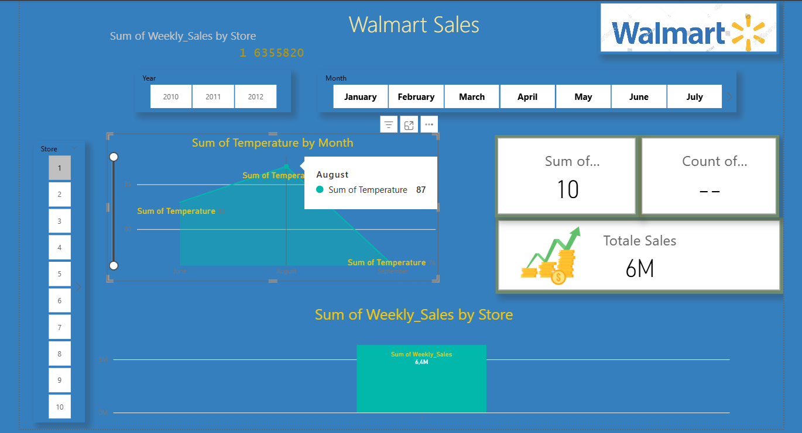

# Walmart Sales Analysis Dashboard

A Power BI project analyzing Walmart sales data from Kaggle, featuring visualizations of weekly sales by store, temperature trends by month, and total sales performance. Built using Power BI Desktop with DAX calculations.

## How to Run
1. Download the .pbix file.
2. Open in Power BI Desktop.
3. Refresh data if needed (original dataset from [Kaggle](https://www.kaggle.com/datasets/yasserh/walmart-dataset)).

## Screenshots

Note: Dataset not included due to size; link above.